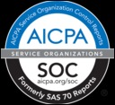

---

copyright:
  years: 2017
lastupdated: "2017-01-16"

---

{:new_window: target="_blank"}
{:shortdesc: .shortdesc}
{:screen: .screen}
{:codeblock: .codeblock}
{:pre: .pre}

<!-- Acrolinx: 2017-01-16 -->

# Cloudant Security Compliance

## Security Compliance Certifications

{{site.data.keyword.cloudantfull}} provides a trustworthy and secure cloud database system.
The service is built on best-in-industry standards,
including ISO 27001 and ISO 27002.

## Top-Tier Physical systems

The {{site.data.keyword.cloudant_short_notm}} DBaaS is physically hosted
on Tier-1 cloud infrastructure providers such as IBM (SoftLayer) and Amazon.
Therefore,
your data is protected by the network and physical security measures that are employed by these hosts,
including (but not limited to):

-   Certifications: Compliance with SSAE16, SOC1, ISAE 3402, ISO 27001, CSA, and other standards.
-	Identity and access management.
-	'24 x 7' physical security of data centers and network operations center monitoring.
-	Server hardening.
-	Full-system virus scanning and patching of systems.
-	{{site.data.keyword.cloudant_short_notm}} gives you the flexibility to choose or switch
    among the different providers as your SLA and cost requirements change.

## HIPAA

>   **Note**: HIPAA compliance is not applicable for a {{site.data.keyword.Bluemix_notm}} {{site.data.keyword.cloudant_short_notm}} instance.

{{site.data.keyword.cloudant_short_notm}} Enterprise,
when hosted on IBM SoftLayer,
meets the required IBM controls that are commensurate with
the Health Insurance Portability and Accountability Act of 1996 (HIPAA) Security and Privacy Rule requirements.
These requirements include appropriate administrative,
physical,
and technical safeguards required of Business Associates in 45 CFR Part 160 and Subparts A and C of Part 164.

## International Organization for Standardization (ISO)

{{site.data.keyword.cloudant_short_notm}} is certified under
the International Organization for Standardization (ISO) 27001 standard,
which defines the expectations for information security management processes.
The ISO 27001 standard specifies the requirements for establishing,
implementing,
and documenting "Information Security Management Systems" (ISMS)
and the requirements for implementing security controls,
according to the needs of individual organizations.
The ISO 27000 family of standards incorporates a process of scaling risk and valuation of assets,
with the goal of safeguarding the confidentiality,
integrity,
and availability of the written,
oral,
and electronic information.

{{site.data.keyword.cloudant_short_notm}} is audited by a third-party security firm
and meets all of the requirements for ISO 27001:
[Bluemix ISO 27001:2013 Certificate of Registration ](ftp://public.dhe.ibm.com/cloud/bluemix/compliance/Bluemix_ISO27K1_WWCert_2016.pdf){:new_window}.

## SOC 2 Certification

IBM provides SOC 2 reports for {{site.data.keyword.cloudant_short_notm}}.
These reports evaluate IBM's operational controls according to criteria
set by the American Institute of Certified Public Accountants (AICPA) Trust Services Principles.
The Trust Services Principles define adequate control systems and establish industry standards
for services providers such as SoftLayer to safeguard their customers' data and information.

Customers can request SOC 2 reports from the customer portal
or [contact the sales team ](https://cloudant.com/history/contact-us/){:new_window}.
