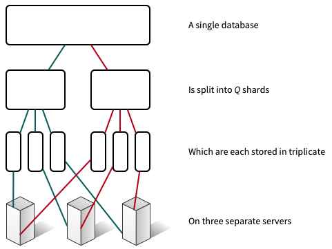
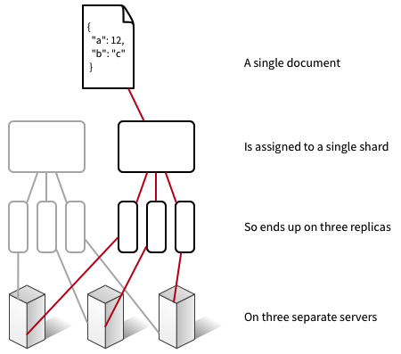

---

copyright:
  years: 2017
lastupdated: "2017-05-05"

---

{:new_window: target="_blank"}
{:shortdesc: .shortdesc}
{:screen: .screen}
{:codeblock: .codeblock}
{:pre: .pre}

<!-- Acrolinx: 2017-MM-DD -->

# How is data stored in Cloudant?

Every database in Cloudant is formed of one or more distinct _shards_, where the number of shards is referred to as _Q_. A shard is a distinct subset of documents from the database and is physically stored in triplicate. Each shard copy is called a shard _replica_. Each shard replica is stored on a different server.



A document is assigned to a particular shard by using consistent hashing of its ID.
This assignment means that a document is always stored on a known shard and a known set of servers.



One caveat to storing a document on the same set of servers every time is that sometimes shards are _rebalanced_.
Rebalancing involves moving replicas to different servers.
The number of shards and replicas stays the same, and documents remain assigned to the same shard,
but the storage location for each shard replica changes.

The default _Q_ value is different for different clusters. The value can be tuned over time.

Technically, the number of replicas is also configurable. However, observing and measuring many systems indicates that three replicas is a pragmatic number for most cases to achieve a good balance between performance and data safety. It would be exceptional and unusual for a Cloudant system to use a different replica count.


## How does sharding affect performance?

The number of shards for a database is configurable because it affects database performance in a number of ways.

When a request comes into the database cluster, one node in the cluster is assigned as the _coordinator_ of that request. This coordinator makes internal requests to the nodes that hold the data relevant to the request, and returns the result to the client.

The number of shards for a database can affect the performance in two ways:

- Because each document is stored on a single shard, having many shards enables greater parallelism for single document lookup and write. The reason is that the coordinator sends requests only to the nodes that hold the document. Therefore, other nodes can continue on tasks without interruption from the coordinator request.
- Because queries must process results from all shards, having more shards introduces a greater processing demand. The reason is that the coordinator must make one request per replica, then combine the results in a streaming fashion before it can return data to the client.

Therefore, establish the predominant request pattern first, before you estimate the shard count. For example, are the requests mostly about single document operations, or mostly queries? Which operations are time-sensitive?

For all queries, the coordinator issues read requests to all replicas. This is because each replica maintains its own copy of the indexes which power queries. An important implication of this is that having more shards enables index building to be more parallelized, presuming document writes are evenly distributed across the shards in the cluster. However, it is hard to predict indexing load across the nodes in the cluster. In practice this prediction tends to be less useful than considering request patterns. The reason is that a large number of document writes indicate a need for larger shard counts.

For the sizing of data, there are considerations about the number of documents per shard. Each shard holds its documents in a large B-tree on disk. Indexes are stored in the same way. As more documents are added to a shard, the depth an average document lookup or query must traverse the B-tree increases and slows down requests as more data must be read from caches or disk.

In general, Cloudant observations are to avoid having more than 10 million documents per shard. In terms of overall shard size, keeping shards under 10 GB is helpful for operational reasons. For example, smaller shards are easier to move over the network during rebalancing.

Given these competing requirements, a single _Q_ value cannot work optimally for all cases. Cloudant tunes the defaults for clusters over time as usage patterns change. However, for particular databases, it's worth taking the time to consider future request patterns and sizing issues to select an appropriate number of shards. Testing with representative data and request patterns is essential for accurate estimations of good _Q_ values. Be prepared for production experience to alter those expectations.

## Summary

In addition to the earlier considerations,
some simple guidelines might be helpful when you are starting.
However,
it is useful to consider testing with representative data, particularly for larger databases:

- If your data is trivial in size - a few tens or hundreds of MB, or thousands of documents - there is little need for more than a single shard.
- For databases of a few GB or few million documents, single-digit shard counts work fine, such as 8.
- For larger databases of tens to hundreds of millions of documents or tens of GB, consider 16 shards.

For extremely large databases, consider manually sharding your data into several databases. For such large databases, contact Cloudant support for advice.

>	**Note:** These numbers are derived from observation and experience rather than precise calculation.

## API

### Setting shard count

The number of shards, _Q_, for a database is set when the database is created. It cannot be changed later. To do this, use the _q_ query string parameter:

```
curl -XPUT -u myaccount https://myaccount.cloudant.com/mynewdatabase?q=8
```

>	**Note:** Setting _Q_ for databases is not enabled on most multi-tenant clusters. For these clusters, trying to set _Q_ results in a [`403` response](../api/http.html#403) with the body:

```json
{
	"error": "forbidden",
	"reason": "q is not configurable"
}
```
{:codeblock}


### Setting the replica count

CouchDB 2+ allows changing the replica count. However, Cloudant doesn't suggest changing this from the default (3) under any circumstances and disallows specifying different values when you create a database. For further help, contact Cloudant support.

### What are these _R_ and _W_ arguments?

Certain individual document requests can have arguments that affect the coordinator's behavior. These arguments are known as _R_ and _W_ after their names in the request query string. They can be used only for single document operations and have _no effect_ for query-style operations.

Typically, _R_ and _W_ are not that useful to specify. In particular, specifying either _R_ or _W_ does not alter consistency for that read or write.

#### What is _R_?

_R_ can be used for single document lookups. It affects how many responses must be received by the coordinator from the nodes that host the replicas of the shard that contains the document, before the coordinator responds to the client. 

Setting _R_ to _1_ can improve throughput because the coordinator is able to send a response sooner. The default for _R_ is _2_, which is most replicas. If the number of replicas is higher or lower than _3_, the default for _R_ changes correspondingly.

#### What is _W_?

_W_ can be specified on single document write requests. Like _R_, _W_ affects how many responses the coordinator waits to receive before it replies to the client.

>	**Note:** _W_ doesn't affect actual write behaviour in any way.

The value of _W_ doesn't affect whether the document is written within the database or not. Instead, the only effect of specifying _W_ is that the client can learn from a request's HTTP status code whether or not _W_ nodes responded to the coordinator: the coordinator waits up to a timeout for _W_ responses from nodes hosting copies of the document, then sends its response to the client.
