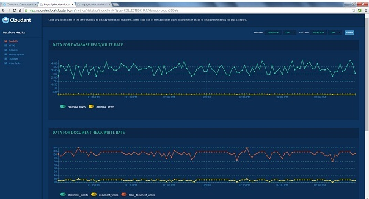

---

copyright:
  years: 2015, 2017
lastupdated: "2017-02-13"

---

{:new_window: target="_blank"}
{:shortdesc: .shortdesc}
{:screen: .screen}
{:codeblock: .codeblock}
{:pre: .pre}

# Displaying the Metrics application

This example shows how to create the Metrics web application URL
and display the Metrics application.
{:shortdesc}

<ol>
<li>Replace the variables in the following default URL for the
    Metrics application.
    
`protocol://loadbalancer.company.com/metrics_app/statistics/index.html`

<ol type=a>
<li>If Cloudant&reg; Local is configured to use Secure Sockets
    Layer (SSL), replace protocol with `http` or `https`.

For more information about SSL, see [Configuring SSL](clinstall_configure_ssl.html).
</li>
<li>Replace `loadbalancer.company.com` with your load balancer
    host name, such as `cloudantlocal.cloudant.com`.</li>
<li>If needed, replace `metrics_app` with the `METRICS_DBNAME`
    you entered in the `metrics.ini` file and append `_app` to
    it.
    
The default value for the `METRICS_DBNAME` field is
    `metrics_app`. Therefore, if you did not change the default
    value, enter the literal value `metrics_app` as part of the
    URL.

    
This example shows a Metrics application URL, with a user
    specified, to display the Metrics application.

    
`https://cloudantlocal.cloudant.com/metrics_app/statistics/index.html`
</li>
</ol>
</li>
<li>When you log in to the Metrics application for the first time,
    the Metrics login page opens.

    
The example shows the data that appears on the Metrics
    application for Database Read/Write Rate and Document
    Read/Write Rate in graph form.

    

</li>
</ol>
