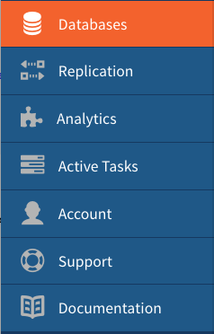

---

copyright:
  years: 2015, 2017
lastupdated: "2017-05-18"

---
{:new_window: target="_blank"}
{:shortdesc: .shortdesc}
{:screen: .screen}
{:codeblock: .codeblock}
{:pre: .pre}

# Creating a Cloudant Query

This tutorial demonstrates how to create a design document and an index, and how to use Cloudant Query to extract specific data
from the database.

To begin, you create the `rolodex` database, some JSON documents that contain the data for these exercises, and a design document that  
contains information about how to build your index. Next, you create an index and run queries against it. 

In this tutorial, you can use either Cloudant
Dashboard or the command line. Instructions for both methods are provided. Follow the links that are provided throughout 
this tutorial for more information.

You complete the following tasks during this tutorial:

1.  [Create a database.](create_query.html#creating-a-database)
2.  [Create a design document.](create_query.html#creating-a-design-document)
3.  [Create an index.](create_query.html#creating-an-index)
4.  [Create a query.](create_query.html#creating-a-query)


## Creating a database

In this section, you create the `rolodex` [database](../api/database.html#create) which is the database that we use in this tutorial.
<p>From the command line:</p>
<ol><li>Create a database by running this command.
<p><code>curl https://$ACCOUNT.bluemix.cloudant.com/rolodex -X PUT</code></p>
<p><i>Results:</i></p>
<code>{"ok":true}</code></li></ol>

<p>From the Cloudant Dashboard:</p>
<ol><li>Create an IBM Bluemix Cloudant account [here](https://console.ng.bluemix.net/registration/?target=%2Fcatalog%2Fservices%2Fcloudant-nosql-db%2F) if you do not already have one.</li>
<li>Log in to the Cloudant Dashboard.</li>
<li>From the Cloudant Dashboard, create a database by following these steps. 
<ol type=a><li>Select the Databases tab.
<p></p></li>
<li>Click <b>Create Database</b>. </li>
<li>Type <code>rolodex</code> and click <b>Create</b>.
<p>The <code>rolodex</code> database automatically opens.</p>
</li></ol></li>
</ol>

### Listing all databases

Verify that the `rolodex` database was created correctly. 

From the command line:
Show the database associated with your account by running this command.
```json
curl https://$ACCOUNT.bluemix.cloudant.com/_all_dbs
```
*Results:*
```["rolodex"]```

From the Cloudant Dashboard:
Click the Databases tab.

The `rolodex` database appears in the list on the Your Databases tab.


### Deleting a database

If you decide to delete the database, for example, if you made a mistake, you can delete the database and start again. 

<p>From the command line:</p>
<ol><li>Delete the database by running this command.
<p><code>curl https://$ACCOUNT.bluemix.cloudant.com/rolodex -X DELETE</code>
<p><i>Results:</i></p>
<code> {"ok":true}</code></li></ol>

<p>From the Cloudant Dashboard:</p>
<ol>
<li>Select Your Databases tab.</li>
<li>Click the **Delete** button next to the database you want to delete.</li> 
<li>Type the name of the database and click **Delete Database**.</li>
</ol>

## Creating documents in the database

The JSON documents we create here contain the data we query in later exercises. 

<p>From the command line:</p>

<ol><li>Copy the sample data below to a data file named <code>bulkcreate.dat</code> to create all five documents.
<p><pre>{
	"docs": {
        "firstname": "Sally",
        "lastname": "Brown",
        "age": 16,
        "city": "New York City",
        "state": "New York", 
        "_id": "doc1"
    },
        { 
        "firstname": "John",
        "lastname": "Brown",
        "age": 21,
        "city": "New York City",
        "state": "New York",
        "_id": "doc2"
    },
        {
        "firstname": "Greg",
        "lastname": "Greene",
        "age": 35,
        "city": "San Diego",
        "state": "California",
        "_id": "doc3"
    },
        {
        "firstname": "Amanda",
        "lastname": "Greene",
        "age": 44,
        "city": "Syracuse",
        "state": "New York",
        "_id": "doc4"
    },
        {
        "firstname": "Lois",
        "lastname": "Brown",
        "age": 33,
        "city": "Baton Rouge",
        "state": "Louisiana",
        "_id": "doc5"
    }
  ]
}</pre></p></li></ol>
<li>Run this command to create the documents. 
<p>When you run the POST command in the next step, five individual documents are created at once. </p>
<p><code>curl https://$ACCOUNT.bluemix.cloudant.com/rolodex/_bulk_docs -X POST -H "Content-Type: application/json" -d \@bulkcreate.dat</code></p>
<p><i>Results:</i></p> 
<p><pre>[{"ok":true,
"id":"doc1","rev":"1-57a08e644ca8c1bb8d8931240427162e"},
{"ok":true,"id":"doc2","rev":"1-bf51eef712165a9999a52a97e2209ac0"},
{"ok":true,"id":"doc3","rev":"1-9c9f9b893fcdd1cbe09420bc4e62cc71"},
{"ok":true,"id":"doc4","rev":"1-6aa4873443ddce569b27ab35d7bf78a2"},
{"ok":true,"id":"doc5","rev":"1-d881d863052cd9681650773206c0d65a"}]</pre></p>
<p><b>Note:</b> Notice that the '@' symbol, used to indicate that the data is included in a file, is identified by the supplied name.</p></li>

<p>From the Cloudant Dashboard:</p>
<ol>
<li>From the <b>All Documents</b> tab, click <b>+</b> and select <b>New Doc</b>.
<p>The New Document window opens. </p></li>
<li>To create a JSON document, copy the following sample text and replace the existing text in the new document.
<p><i>First sample document</i>:<br>
<pre>{ "_id": "doc1",
"firstname": "Sally",
"lastname": "Brown",
"age": 16,
"city": "New York City",
"state": "New York" 
}</pre></p>
</li>
<li>Repeat the previous step and add the remaining documents to the database.
<p><i>Second sample document</i>:<br>
<pre>{ "_id": "doc2",
  "firstname": "John",
  "lastname": "Brown",
  "age": 21,
  "city": "New York City",
  "state": "New York"
}</pre></p>
<p><i>Third sample document:</i><br>
<pre>{"_id": "doc3",
"firstname": "Greg",
"lastname": "Greene",
"age": 35,
"city": "San Diego",
"state": "California"
}
</pre>
</p>
<p><i>Fourth sample document:</i><br>
<pre>{"_id": "doc4",
"firstname": "Amanda",
"lastname": "Greene",
"age": 44,
"city": "Syracuse",
"state": "New York"
}</pre>
</p>
<p><i>Fifth sample document:</i><br>
<pre>{"_id": "doc5",
"firstname": "Lois",
"lastname": "Brown",
"age": 33,
"city": "Baton Rouge",
"state": "Louisiana"
}
</pre>
</li>
<p>The `rolodex` database was created and populated with five JSON documents. </p></li></ol>


### Listing all the documents in the database

Check the database to verify that all the documents in the previous exercise were created successfully. 

<p>From the command line:</p>
<ol><li>List all the documents in the database.
<p><code>curl https://$ACCOUNT.bluemix.cloudant.com/rolodex/_all_docs</code></p>
<p><i>Results:</i></p>
<p><pre>{"total_rows":5,"offset":0,"rows":[
    {"id":"doc1","key":"doc1","value":{"rev":"1-bf51eef712165a9999a52a97e2209ac0"}},
    {"id":"doc2","key":"doc2","value":{"rev":"1-57a08e644ca8c1bb8d8931240427162e"}},
    {"id":"doc3","key":"doc3","value":{"rev":"1-9c9f9b893fcdd1cbe09420bc4e62cc71"}},
    {"id":"doc4","key":"doc4","value":{"rev":"1-6aa4873443ddce569b27ab35d7bf78a2"}},
    {"id":"doc5","key":"doc5","value":{"rev":"1-d881d863052cd9681650773206c0d65a"}},
  ] 
}
</pre><p></li>
<li>From the Cloudant Dashboard, select <b>Databases</b> > `rolodex` database > <b>All Documents<b>.</li>
<li>Verify that all the documents appear.</li>
</ol>


## Creating a design document

[Design documents](../api/design_documents.html#design-documents) contain instructions about how views
and indexes must be built. When you change a design document, the index is overwritten and
re-created from scratch.

Indexes and views have the same purpose—to improve processing and return time for database queries. However, the mechanics are different.
A view selectively filters documents. In Cloudant, views are written using Javascript functions.
You define a view in the `view` field inside a design
document. When you run a query using your view, Cloudant applies the Javascript function to all the documents in the database.

Cloudant search indexes are also defined in design documents. Each index is defined by an index function that determines the data to index
and store. These indexes use [Lucene Query
Parser Syntax](http://lucene.apache.org/core/4_3_0/queryparser/org/apache/lucene/queryparser/classic/package-summary.html#Overview)
to query databases.

To create a design document:

<p>From the command line:</p>
<ol><li>Create a design document by running this command.
<p><code>curl https://$ACCOUNT.bluemix.cloudant.com/rolodex -X POST -H "Content-Type: application/json" -d "{ \"_id\": \"doc1410\", \"_id\": \" rolodex-index-design-doc\" }"</code></p>
<p><i>Results:</i></p>
<p><code>{"ok":true,"id":" rolodex-index-design-doc","rev":"1-967a00dff5e02add41819138abb3284d"}</code><p>
</li></ol>

<p>From Cloudant Dashboard:</p>
<ol>
<li>Select <b>Design Documents</b> and click <b>Create</b> > <b>New Doc</b>.</li>
<li>Replace the <code>_id</code> value with <code>rolodex-index-design-doc</code> as seen in the example.
<pre>
{
  "_id": "rolodex-index-design-doc"
}
</pre>
<li>Click <b>Create Document</b>.
<p>The <code>rolodex-index-design-doc</code> design document is created.</p></li>
</ol>

## Creating an index

In Cloudant, you use [search indexes](../api/search.html#search). You can specify a json or text type index. 
Creating a ["type=json"](../api/cloudant_query.html#creating-a-type-json-index) index reduces the load on
your environment and the size of your data set. You use this type of index if you are familar with your data and have a good idea  
what you want to find. 

If you choose a "type=text" index, 
all the documents and fields in your database are automatically indexed. As such, you can
search and retrieve information from any field. The time this takes varies based on the size of your data set. 

For this tutorial, we create a "type=json" index. If you want to create a ["type=text"](../api/cloudant_query.html#creating-a-type-text-index) index, 
change the value in the `type` field to `text`. 

To create an index:

<ol><li>From the command line, run this command to create an index.
<p><code>curl https://$ACCOUNT.bluemix.cloudant.com/rolodex/_index -X POST -H "Content-Type: application/json" -d \@jsonindex.dat</p></code>
<p><i>Sample JSON index</i></p>
</p><code>{"ok":true,"id":"b92e4b2bcf0020b41255252ef7722854","rev":"1-ca5d4b21e532dddcd56d6507b79d9511"}</code></p>
</li>
<li>From the Cloudant Dashboard, create an index by following these steps:
<ol type=a><li>Click <b>+</b> > <b>New Search Index</b>.</li>
<li>Select <b>New document</b> from the <b>Save to design document</b> drop-down menu.</li>
<li>Type <code>rolodex-index-design-doc</code> in the <code>_design</code> field.</li>
<li>Type <code>JSONindex</code> in the Index name field.</li>
<li>Replace the text in the Search index function field with the text in the sample.
<p><i>Results:</i></p>
<p><pre>
{    
	 "index": {       
            "fields": ["firstname", "lastname", "city", "age"]  
                    },
	 "name": "JSONindex",
	 "type": "json"            
    } 
</pre></p>
</li></ol></li>
<li>Accept the remaining default options.</li>
<li>Click <b>Create Document and Build Index</b>.</li>
</ol></li>
</ol>

The `JSONindex` was created. 

### Listing Cloudant Query indexes

Verify that the `JSONindex` is [listed](../api/cloudant_query.html#list-all-cloudant-query-indexes) in the `rolodex` database.

<ol><li>From the command line, run this command to search for an index. 
<p><code>curl https://$ACCOUNT.bluemix.cloudant.com/rolodex/_index</code>
<p><i>Results:</i></p>
<p><pre>{"total_rows":1,"indexes":[{"ddoc":null,"name":"_all_docs","type":"special","def":{"fields":[{"_id":"asc"}]}}]}
</pre></p></li>
<li>From the Cloudant Dashboard, select <b>Databases</b> > <b>Design Documents</b> to expand <code>rolodex-index-design-doc</code>.</li>
<li>Expand <b>Search Indexes</b>.
<p>You can see the JSONindex you created. You can edit, clone, or delete indexes here. When you select an index, you can use it to query the database.</p></li>
</ol>


## Creating a query

When you create your [query](../api/cloudant_query.html#query) statement, you can narrow the data that you search with [selector syntax](../api/cloudant_query.html#selector-syntax) and
[implicit](../api/cloudant_query.html#implicit-operators) or [explicit](../api/cloudant_query.html#explicit-operators) operators.

In a [selector expression](../api/cloudant_query.html#creating-selector-expressions), you specify at least one field and
its corresponding value. When the query runs, it uses these values to search the database for matches. The
selector is a JSON object. For this exercise, you use the selector expression that is described here.

### Running a query with a selector statement

Specify the documents that you want to find in the database by using the `selector` parameter. For example, everyone who lives in New York City, New York.

```json
{
  "selector": {
        "city" : "New York City",  
        "state": "New York",
        "firstname": {"$gt": null}        
    }
```    
{:codeblock}

Specify how you want the information that is returned in the `fields` parameter. In this case, the first and last
name of everyone who meets the search criteria. The results are sorted by first name in ascending order based on the `sort` parameters values.

```json
{
"fields": ["firstname","lastname"  
    ],
  "sort": [
    {
      "firstname": "asc"
    }  
```  
{:codeblock}

For anything but the most simple query, add the JSON to a data file and run it from the command line as shown below.  

To run the query:

<ol><li>From the command line, run this query.
<p><code>curl https://$ACCOUNT.bluemix.cloudant.com/rolodex/_find -X POST -H "Content-Type: application/json" -d \@query1.dat</code></p>
</li>
<li>From the Cloudant Dashboard, click the <code>JSONindex</code> index that you created earlier by expanding <code>rolodex-index-design-doc</code> > <b>Search Indexes</b> > <b>JSONindex</b>.</li>
<li>Copy and paste the following selector statement to the Query field and click <b>Query</b>.  
<p><pre>
{
  "selector": {
        "city" : "New York City",    
       "state": "New York",      
       "firstname": {"$gt": null}
      },    
   "fields": ["firstname","lastname", "city" ],
   "sort": [ { "firstname": "asc" } ],
   “use_index”: [ “JSONindex”]		
}
</pre></p>
<p><i>Results:</i></p>
<p><pre>{
"docs":
   [
    {"firstname":"John","lastname":"Brown","city":"New York City"},
    {"firstname":"Sally","lastname":"Brown","city":"New York City"}
   ]
 }
</pre></p></li></ol>


### Running a query with operators

This example searches the database for people with the last name Brown who are older than 20 years.

```json
{
    "selector": {
        "$and": [
              {
                "$text": "Brown"
               },
            {
                "$gt": 20
            }
       ]
  }
```   
{:codeblock}

Based on the values specified in the `field` parameter, the results include the first name, last name, and age sorted by first name in ascending order.

```json
 },
        "fields": [
            "firstname", "lastname", "age"],
  "sort": [
       {
          "firstname": "asc"
        }
     ]            
 }
```
{:codeblock}

To run the query:

1.  From the command line, run this query:
```json
curl https://$ACCOUNT.bluemix.cloudant.com/rolodex/_find -X POST -H "Content-Type: application/json" -d \@query2.dat
```
2.  From the Cloudant Dashboard, click the `JSONindex` index that you created earlier by expanding `rolodex-index-design-doc` > **Search Indexes** > **JSONindex**.
3.  Copy and paste the JSON into the Query field and click **Query**.  
```json
{
    "selector": {
        "$and": [
             {
                "$text": "Brown"
             },
            {
                "$gt": 20
            }
        ]
   },
        "fields": [
            "firstname", "lastname", "age"],
  "sort": [
      {
      "firstname": "asc"
      }
    ]            
 }
```
_Results:_
```json
{
  "docs": [
 {     
    "firstname": "John",
    "lastname": "Brown",
    "age": "21"
       },
 {     
    "firstname": "Lois",
    "lastname": "Brown",
    "age": "33"
       }       
  ]
}
```
{:codeblock}
