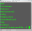
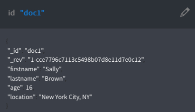
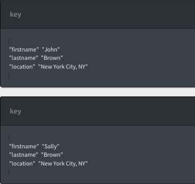
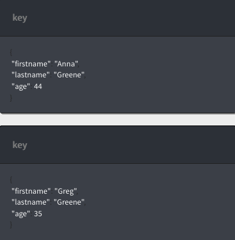

---

copyright:
  years: 2015, 2017
lastupdated: "2017-06-12"

---
{:new_window: target="_blank"}
{:shortdesc: .shortdesc}
{:screen: .screen}
{:codeblock: .codeblock}
{:pre: .pre}

# Creating a Cloudant Query

This tutorial demonstrates how to create a database and populate it 
with documents, as well as, how to create an index and use the index to query the database.

Exercises for both the </img> command line 
and </img> Cloudant Dashboard are provided. The
Cloudant Dashboard exercises give you a visual example of the concepts we cover. You can follow the links provided 
throughout the tutorial for more information.

To begin, you create the `query-demo` database and some JSON documents that 
contain the data for these exercises.

After you complete this tutorial, you will know how to complete the following tasks:

1.  [Create a database.](create_query.html#creating-a-database)
2.  [Create an index.](create_query.html#creating-an-index)
3.  [Query the database.](create_query.html#creating-a-query)

## Assumptions

Before you begin, follow these steps to prepare for the tutorial:

<ol><li><a href="https://console.ng.bluemix.net/registration/">Create a Bluemix account</a>.</li>
<li>Log in to the <a href="https://console.ng.bluemix.net/catalog/services/cloudant-nosql-db">Cloudant Dashboard</a>.</li>
<li><a href="https://console.ng.bluemix.net/docs/services/Cloudant/tutorials/create_service.html#creating-a-cloudant-instance-on-bluemix">Create a Cloudant instance on Bluemix</a>.</li>
<li>(Optional) <a href="https://console.ng.bluemix.net/docs/services/Cloudant/guides/acurl.html#authorized-curl-acurl-">Create an acurl alias</a> to make it easier and faster to run commands from the command line.</li>
<li>Replace the <code>$ACCOUNT</code> variable in the following commands with the name you use to 
    log in to Cloudant Dashboard. If you decide not to set up <code>acurl</code>, use this
    URL instead of the one provided in the exercises. 
    <p><code>curl https://$ACCOUNT:$PASSWORD@$ACCOUNT.cloudant.com/query-demo</code></p></li>
</ol>

 

## Creating a database

In this section, you create the `query-demo` [database](../api/database.html#create) which 
is the database that we use in this tutorial.

</img> Command line 

<ol><li>Create a database by running this command.
<p><code>acurl https://$ACCOUNT.cloudant.com/query-demo -X PUT</code></p>
<li>Verify that the database was created successfully in the results. 
<p><i>Results</i>:</p>
<p><code>{"ok":true}</code></p></li></ol>

</img> Cloudant Dashboard

<ol><li>Open the Cloudant service instance that you created. </li>
<li>Select the Databases tab. 
<p></img></p></li>
<li>Click <i>Create Database</i>. </li>
<li>Enter <code>query-demo</code> and click <b>Create</b>.
<p>The <code>query-demo</code> database automatically opens.</p>
</li>
</ol>

## Creating documents in the database

The JSON [documents](https://console.stage1.bluemix.net/docs/services/Cloudant/api/document.html#documents) that you create in this exercise contain the data you use to query the `query-demo` database in later exercises. 

</img> Command line

<ol><li>Copy the sample text to a data file named <code>bulkcreate.dat</code> to create all five documents.
<p><pre>{
	"docs": 
       [
	{ 
		"_id": "doc1",
		"firstname": "Sally",
		"lastname": "Brown",
		"age": 16,
		"location": "New York City, NY"
    },
  { 
		"_id": "doc2",
        "firstname": "John",
	    "lastname": "Brown",
	    "age": 21,
        "location": "New York City, NY"
  },
   {
		"_id": "doc3",
		"firstname": "Greg",
		"lastname": "Greene",
		"age": 35,
		"location": "San Diego, CA"
   },
  {
		"_id": "doc4",
		"firstname": "Anna",
		"lastname": "Greene",
		"age": 44,
		"location": "Baton Rouge, LA"
  },
   {
		"_id": "doc5",
		"firstname": "Lois",
		"lastname": "Brown",
		"age": 33,
		"location": "Syracuse, NY"
   }
  ]
}</pre></p></li>
<li>Run this command to create the documents. 
<p><code>acurl https://$ACCOUNT.cloudant.com/query-demo/_bulk_docs -X POST -H "Content-Type: application/json" -d \@bulkcreate.dat</code></p>
<p><b>Note</b>: Notice that the '@' symbol, used to indicate that the data 
is included in a file, is identified by the supplied name.</p>
<p><i>Results</i>:</p> 
<p><pre>[{"ok":true,
"id":"doc1","rev":"1-57a08e644ca8c1bb8d8931240427162e"},
{"ok":true,"id":"doc2","rev":"1-bf51eef712165a9999a52a97e2209ac0"},
{"ok":true,"id":"doc3","rev":"1-9c9f9b893fcdd1cbe09420bc4e62cc71"},
{"ok":true,"id":"doc4","rev":"1-6aa4873443ddce569b27ab35d7bf78a2"},
{"ok":true,"id":"doc5","rev":"1-d881d863052cd9681650773206c0d65a"}]</pre></p>
</li></ol>

</img> Cloudant Dashboard

<ol>
<li>Click <b>+</b> and select <b>New Doc</b>.
<p>The New Document window opens. </p></li>
<li><a name="step3"></a> To create a JSON document, copy the following sample text and replace the existing text in the new document.
<p><i>First sample document</i>:<br>
<pre>{ 
        "firstname": "Sally",
        "lastname": "Brown",
        "age": 16,
        "location": "New York City, NY",
        "_id": "doc1"
     }</pre></p>

</li>
<li>Repeat <a href="#step3">step 3</a> to add the remaining documents to the database.
<p><i>Second sample document</i>:<br>
<pre>{ 
        "firstname": "John",
        "lastname": "Brown",
        "age": 21,
        "location": "New York City, NY",
        "_id": "doc2"
   }</pre></p>
<p><i>Third sample document</i>:<br>
<pre> {
        "firstname": "Greg",
        "lastname": "Greene",
        "age": 35,
		"location": "San Diego, CA",
        "_id": "doc3"
     }
</pre>
</p>
<p><i>Fourth sample document</i>:<br>
<pre>{
        "firstname": "Anna",
        "lastname": "Greene",
        "age": 44,
		"location": "Baton Rouge, LA",
        "_id": "doc4"
      }</pre>
</p>
<p><i>Fifth sample document</i>:<br>
<pre>{
        "firstname": "Lois",
        "lastname": "Brown",
        "age": 33,
        "location": "New York City, NY",
        "_id": "doc5"
     }
</pre>
</li>
<p>The `query-demo` database was created and populated with five JSON documents. </p></li></ol>

## Creating an index

Cloudant provides views and indexes to query the database. An index is a way to structure 
data that improves retrieval time. A view runs a query that is saved to the database, and 
the result is called the result set. When you submit a query to the view, your query searches 
the result set. 

You can use the primary index that comes with Cloudant, or secondary indexes like views 
(MapReduce), search indexes, Cloudant Geospatial queries, or Cloudant Query as described 
in the following list: 

*	Primary index – look up a document or list of documents by ID.  
*	[View](https://console.stage1.bluemix.net/docs/services/Cloudant/api/creating_views.html#views-mapreduce-) – search for information in the database that matches the search criteria you specify, such as counts, sums, averages, and other mathematical functions. The criteria you can search is specified in the view's definition. Views use the MapReduce paradigm. 
*	[Search index](../api/search.html#search) – create queries to search one or more fields, large amounts of text, or queries that require [Lucene Query Parser Syntax](http://lucene.apache.org/core/4_3_0/queryparser/org/apache/lucene/queryparser/classic/package-summary.html#Overview), such as wild cards, fuzzy search, or facets. 
*	[Cloudant Geospatial](https://console.stage1.bluemix.net/docs/services/Cloudant/api/cloudant-geo.html#cloudant-geospatial) – search for documents based on a spatial relationship. 
*	[Cloudant Query](https://console.stage1.bluemix.net/docs/services/Cloudant/api/cloudant_query.html#query) – use Mongo-style query syntax to search for documents by using one or more logical operators. Cloudant Query is a combination of a view and a search index. We use Cloudant Query in this tutorial. 


</img> Command line

<ol><li>Copy the sample JSON into a data file named <code>query-index.dat</code>.
<p>
<pre>{
  "index": {
    "fields": [
         "lastname",
         "firstname",  
         "location", 
         "age"
    ]
  },
  "name": "query-index",
  "type": "json"
}</pre></p></li>

<li>Run this command to create an index.
<p><code>acurl https://$ACCOUNT.cloudant.com/query-demo/_index -X POST -H "Content-Type: application/json" -d \@query-index.dat</p></code>
<p><i>Results</i>:</p>
</p><pre>{"result":"created",
"id":"_design/752c7031f3eaee0f907d18e1424ad387459bfc1d",
"name":"query-index"}</pre></p>
</li></ol>

</img> Cloudant Dashboard

<ol><li>Click <b>+</b> > <b>Query Indexes</b>.</li>
<li>Paste the following sample JSON into the Index field.
<p><pre>
{
  "index": {
    "fields": [
         "lastname",
         "firstname",  
         "location", 
         "age"
    ]
  },
  "name": "query-index",
  "type": "json"
}</pre></p></li>
<p>The index was created and is ready to query. </p>
</li></ol>


## Creating a query

When you create your [query](../api/cloudant_query.html#query) statement, you can narrow 
your search by using the [selector](../api/cloudant_query.html#selector-syntax) with operators, either
[implicit](../api/cloudant_query.html#implicit-operators) or [explicit](../api/cloudant_query.html#explicit-operators) operators.

In a [selector expression](../api/cloudant_query.html#creating-selector-expressions), you specify at least one field and
its corresponding value. When the query runs, it uses these values to search the database for matches. 

For anything but the most simple query, add the JSON to a data file and run it from the command line.

### Running a simple query

You can search the database for one or multiple fields, with or without operators. This 
query searches for any documents whose `firstname` field contain the value `Sally`. 

</img> Command line

1.  Copy the sample JSON into a data file named `query1.dat`.
```json
{
  "selector": {
        "firstname" : "Sally"            
     }        
}        
```    
{:codeblock}
2.  Run this command to query the database.

    <code>acurl https://$ACCOUNT.cloudant.com/query-demo/_find -X POST -H "Content-Type: application/json" -d \@query1.dat</code>

3.  See the query results.

    _Results:_
    ```json
 {"docs":
   [
        {"_id":"doc1",
        "_rev":"3-751ab049e8b5dd1ba045cea010a33a72",
        "firstname":"Sally",
        "lastname":"Brown",
        "age":16,
        "location":"New York City, NY"}
    ]
}
    ```


</img> Cloudant Dashboard

<ol><li>Click the <b>Query</b> tab..</li>
<li>Copy and paste the following selector statement into the Cloudant Query window. 
<p><pre>{
  "selector": {
     "firstname" : "Sally"            
   }        
}   </pre></p></li>
<li>Click <b>Run Query</b>.
<p>The query results appear in the right pane.</p>
<p></img></p>
</li></ol>

### Running a query with two fields

This example uses two fields to find everyone named Brown who lives in New York City, NY.

```json
{
    "selector": {
            "lastname": "Brown",
            "location": "New York City, NY" 
        }                
    }        
```    
{:codeblock}

You can tailor the result set to meet your requirements. 
The `fields` parameter specifies the fields to return. In this case, the results include the first name, 
last name, and location. The results are sorted by first name in ascending order based on the values in the
`sort` parameter.

```json
  "fields" : [ "lastname", "firstname", "location" ],
  "sort" : [ { "lastname": "asc"},
			 { "firstname": "asc"} ]      
```  
{:codeblock}

</img> Command line

1.  Copy the sample JSON into a data file named `query2.dat`.
    ```json
    {
        "selector": {
            "lastname": "Brown",
            "location": "New York City, NY" 
         },
            "fields": ["firstname", "lastname", "location" ],
              "sort": [ { "lastname": "asc"},
			            { "firstname": "asc"} ] 
     }
    ```
    {:codeblock}
    
2.  Run this command to query the database.

    <code>acurl https://$ACCOUNT.cloudant.com/query-demo/_find -X POST -H "Content-Type: application/json" -d \@query2.dat</code>

3.  See the query results.

    ```json
         {"docs":[
            {"firstname":"John","lastname":"Brown","location":"New York City, NY"},
            {"firstname":"Sally","lastname":"Brown","location":"New York City, NY"}]
         }
    ```
    {:codeblock}
    
</img> Cloudant Dashboard

<ol><li>Click the <b>Query</b> tab.</li>
<li>Copy and paste the following JSON into the Cloudant Query window.  
<p><pre>
{
    "selector": {
       "lastname": "Brown",
       "location": "New York City, NY" 
            },
         "fields": ["firstname", "lastname", "location" ],
           "sort": [ { "lastname": "asc"},
		  	         { "firstname": "asc"} ]  
}
</pre></p></li>
<li>Click <b>Run Query</b>.
<p>The query results appear in the right pane.</p>
<p></img></p>
</li></ol>

### Running a query with operators

In this example, the $eq (equal) and $gt (greater than) operators are used to search 
for documents that contain the last name `Greene` who are older than 30 years.
 

```json
{ "selector": {
    "lastname": {"$eq": "Greene"},
         "age": {"$gt": 30}
 }
```   
{:codeblock}

</img> Command line

1.  Copy this sample JSON to a file named `query3.dat`.
    ```json
    { "selector": {
        "lastname": {"$eq": "Greene"},
             "age": {"$gt": 30}
        },
            "fields" : [ "firstname","lastname", "age" ],
               "sort": [ { "lastname": "asc"},
			             { "firstname": "asc"} ]  
      }
    ```
2. Run this query:

    <code>acurl https://$ACCOUNT.cloudant.com/query-demo/_find -X POST -H "Content-Type: application/json" -d \@query3.dat</code>

3.  See the query results.

    _Results:_
    ```json
    {"docs":[
            {"firstname":"Anna","lastname":"Greene","age":44},
            {"firstname":"Greg","lastname":"Greene","age":35} ]
       }
    ```
    {:codeblock}

</img> Cloudant Dashboard

<ol><li>Click the <b>Query</b> tab.</li>
<li>Copy and paste the JSON into the Cloudant Query window.
<p><pre>
    { "selector": {
        "lastname": {"$eq": "Greene"},
             "age": {"$gt": 30}
        },
            "fields" : [ "firstname","lastname", "age" ],
               "sort": [ { "lastname": "asc"},
			             { "firstname": "asc"} ]   
      }</pre></p></li>
<li>Click **Run Query**.
<p>The query results appear in the right pane.</p>
<p></img></p></li></ol>

For more information about Cloudant-related topics, see the [Cloudant Documentation](https://console.ng.bluemix.net/docs/services/Cloudant/cloudant.html#overview).


