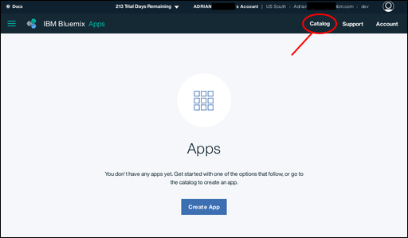
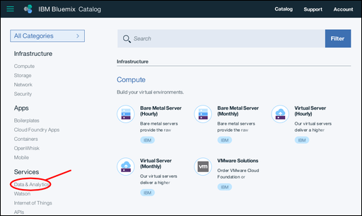
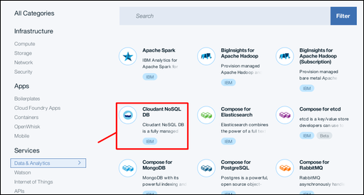
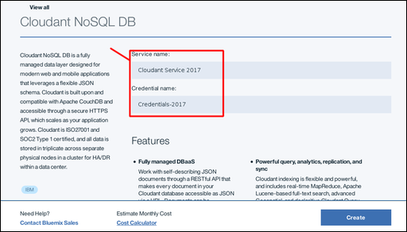
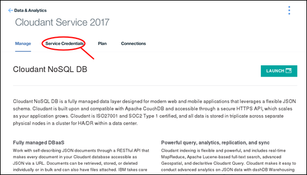
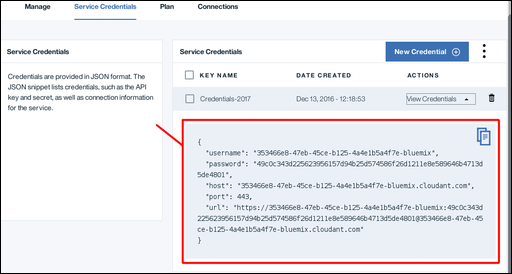
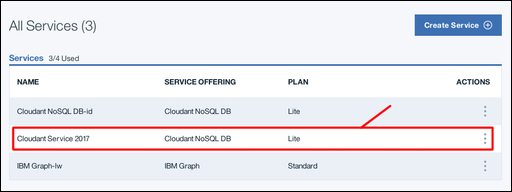

---

copyright:
  years: 2017
lastupdated: "2017-05-15"

---

{:new_window: target="_blank"}
{:shortdesc: .shortdesc}
{:screen: .screen}
{:codeblock: .codeblock}
{:pre: .pre}

# Creating a Cloudant instance on Bluemix using the Cloud Foundry tools

This tutorial shows you how to create an {{site.data.keyword.cloudantfull}}
service instance on {{site.data.keyword.Bluemix_notm}}
using the Cloud Foundry tools.
{:shortdesc}

## Pre-requisites

To follow this tutorial,
you must first install the {{site.data.keyword.Bluemix_notm}} Cloud Foundry tools.
Details for installing the tools are available in
[this separate tutorial](create_bmxapp_appenv.html#the-cloud-foundry-and-bluemix-command-toolkits).

> **Note**: Ensure you install both the Cloud Foundry _and_
  the {{site.data.keyword.Bluemix_notm}} toolkits.

## Identifying the Bluemix API endpoint

Specify the target API endpoint for your Cloud Foundry commands;

```sh
bx api https://api.ng.bluemix.net
```
{:codeblock}

The result confirms that you have correctly identified the endpoint:

```sh
Setting api endpoint to https://api.ng.bluemix.net...
OK

API endpoint: https://api.ng.bluemix.net (API version: 2.54.0)
Not logged in. Use 'bx login' to log in.
```
{:pre}

## Logging in to your Bluemix account

1.  Use the following command to start the login process for
  your {{site.data.keyword.Bluemix_notm}} account:
  
  ```sh
  bx login
  ```
  {:codeblock}
  
  {{site.data.keyword.Bluemix_notm}} replies by reminding you of the current
  API endpoint,
  then asks for the email address of your account:
  
  ```sh
  API endpoint: https://api.ng.bluemix.net
  
  Email>
  ```
  {:pre}

2.  Enter the email address of your account.
  {{site.data.keyword.Bluemix_notm}} then asks for the password for your account:
  ```sh
  API endpoint: https://api.ng.bluemix.net
  
  Email> J.Doe@email.com
  
  Password>
  ```
  {:pre}
  
  {{site.data.keyword.Bluemix_notm}} validates your details,
  then summarizes the information about your login session:
  ```sh
  API endpoint: https://api.ng.bluemix.net
  
  Email> J.Doe@email.com
  
  Password> 
  Authenticating...
  OK
  
  Targeted account J DOE's Account (707...a32)
  
  Targeted org J.Doe@email.com
  
  Targeted space dev
  
  API endpoint:   https://api.ng.bluemix.net (API version: 2.54.0)
  Region:         us-south
  User:           j.doe@email.com
  Account:        J DOE's Account (707...a32)
  Org:            J.Doe@email.com
  Space:          dev
  ```
  {:pre}

3.  You have now logged in to your {{site.data.keyword.Bluemix_notm}} account.

## Choosing the Cloudant plan for your service

Obtain a list of all the available service offerings.
Filter the list to match only {{site.data.keyword.cloudant_short_notm}} services:

```sh
bx service offerings | grep -i Cloudant
```
{:codeblock}

The result is a list of the {{site.data.keyword.cloudant_short_notm}} services
available to your account,
including the specific plans you can select:

```sh
cloudantNoSQLDB   Lite, Standard*
```
{:pre}

**Optional**: To see more details about the plans,
use the following command:

```sh
bx cf marketplace -s cloudantNoSQLDB
```
{:codeblock}

The result is a summary of the available plans,
similar to the following section of an example response (details correct as at May 2017):
```sh
...
Lite   The Lite plan provides access to the full functionality of Cloudant for development and evaluation. The plan has a set amount of provisioned throughput capacity as shown and includes a max of 1GB of encrypted data storage.   free
...
```
{:pre}

## Creating the Cloudant service

The basic command format to create a service instance
within {{site.data.keyword.Bluemix_notm}} is as follows:
```sh
bx service create <service> <plan> <instance name>
```
{:pre}

Assume we want to create an instance of
a {{site.data.keyword.cloudant_short_notm}} service using the `Lite` plan,
where the instance name is `cs20170517a`.
Do this by using a command similar to the following example:
```sh
bx service create cloudantNoSQLDB Lite cs20170517a
```
{:codeblock}

After creating the service instance,
responds with a message similar to the following example:
```sh
Invoking 'cf create-service cloudantNoSQLDB Lite cs20170517a'...

Creating service instance cs20170517a in org J.Doe@email.com / space dev as J.Doe@email.com...
OK

```
{:pre}

## Understanding service credentials

Applications that require access to your {{site.data.keyword.cloudant_short_notm}} service
must have the necessary credentials.

>   **Note**: Service credentials are valuable.
    If anyone or any application has access to the credentials,
    they can effectively do whatever they want with the service instance,
    for example they might create spurious data,
    or delete valuable information.
    Protect these credentials carefully.

The service credentials consist of five fields:

Field      | Purpose
-----------|--------
`host`     | The host name that is used by applications to locate the service instance.
`username` | The user name that is required for applications to access the service instance.
`password` | The password that is required for applications to access the service instance.
`port`     | The HTTP port number for accessing the service instance on the host. Normally 443 to force HTTPS access.
`url`      | A string aggregating the other credential information into a single URL, suitable for use by applications.

## Creating credentials for your Cloudant service

The basic command format to create credentials for a service instance
within {{site.data.keyword.Bluemix_notm}} is as follows:
```sh
bx cf create-service-key cs20170517a creds20170517b
```
{:pre}

Assume we want to create an instance of
a {{site.data.keyword.cloudant_short_notm}} service using the `Lite` plan,
where the instance name is `cs20170517a`.
Do this by using a command similar to the following example:
```sh
bx service create cloudantNoSQLDB Lite cs20170517a
```
{:codeblock}

After creating the service instance,
responds with a message similar to the following example:
```sh
Invoking 'cf create-service cloudantNoSQLDB Lite cs20170517a'...

Creating service instance cs20170517a in org J.Doe@email.com / space dev as J.Doe@email.com...
OK

```
{:pre}


# Old dashboard tutorial content from here onwards...

## Creating a service instance

1.  Log in to your {{site.data.keyword.Bluemix_notm}} account.<br/>
    The {{site.data.keyword.Bluemix_notm}} dashboard can be found at:
    [http://bluemix.net ](http://bluemix.net){:new_window}.
    After authenticating with your user name and password,
    you are presented with the {{site.data.keyword.Bluemix_notm}} dashboard:<br/>
    

2.  Click the `Catalog` link:<br/>
    <br/>
    A list of the services available on {{site.data.keyword.Bluemix_notm}} appears.

3.  Click the `Data & Analytics` entry under the `Services` heading:<br/>
    <br/>
    A list of the Data & Analytics services
    available on {{site.data.keyword.Bluemix_notm}} appears.

4.  Click the {{site.data.keyword.cloudant_short_notm}} service:<br>
    

5.  In the service configuration window,
    enter a service name and a credential name.
    In this example,
    the service name is `Cloudant Service 2017`,
    and the credential name is `Credentials-2017`:<br/>
    

6.  By default,
    the service is created by using the 'Lite' pricing plan,
    which is free but offers limited capacity.
    Other pricing plans,
    with greater capacity,
    [are available](../offerings/bluemix.html).<br/>
    To create the service,
    click the `Create` button:<br/>
    

7.  A service page appears,
    confirming that your new {{site.data.keyword.cloudant_short_notm}} service is available.
    To access the connection information that your application needs to connect to the service,
    click the `Service Credentials` tab:<br/>
    

8.  The Service Credentials window appears.
    To see the credentials that are required to access the service,
    click the `View Credentials` dropdown:<br/>
    

9.  The Service Credentials details appear:<br/>
    

>   **Note**: The service credentials in these examples
    were defined when a demonstration Cloudant service was created on Bluemix.
    The credentials are reproduced here to show how they would appear in the dashboard.
    However,
    the demonstration Cloudant service was removed,
    so these credentials are no longer valid;
    you _must_ supply and use your own service credentials.


## Locating your service credentials

At any time,
you can find the credentials for a service that is associated with your account.

1.  Begin by logging in to Bluemix.
    The {{site.data.keyword.Bluemix}} dashboard can be found at:
    [http://bluemix.net ](http://bluemix.net){:new_window}.
    After authenticating with your user name and password,
    you are presented with the {{site.data.keyword.Bluemix_notm}} dashboard:<br/>
    

2.  Scroll down the Dashboard,
    until you reach the section that lists all your services:<br/>
    

3.  In this example,
    we want to find the service credentials for the {{site.data.keyword.cloudant_short_notm}}
    service instance that was created earlier in the tutorial,
    called `Cloudant Service 2017`.
    Click the corresponding row:<br/>
    

3.  The Service Credentials window appears.
    To see the credentials that are required to access the service,
    click the `View Credentials` dropdown:<br/>
    

4.  The Service Credentials details appear:<br/>
    

>   **Note**: The service credentials in these examples
    were defined when a demonstration Cloudant service was created on Bluemix.
    The credentials are reproduced here to show how they would appear in the dashboard.
    However,
    the demonstration Cloudant service was removed,
    so these credentials are no longer valid;
    you _must_ supply and use your own service credentials.
